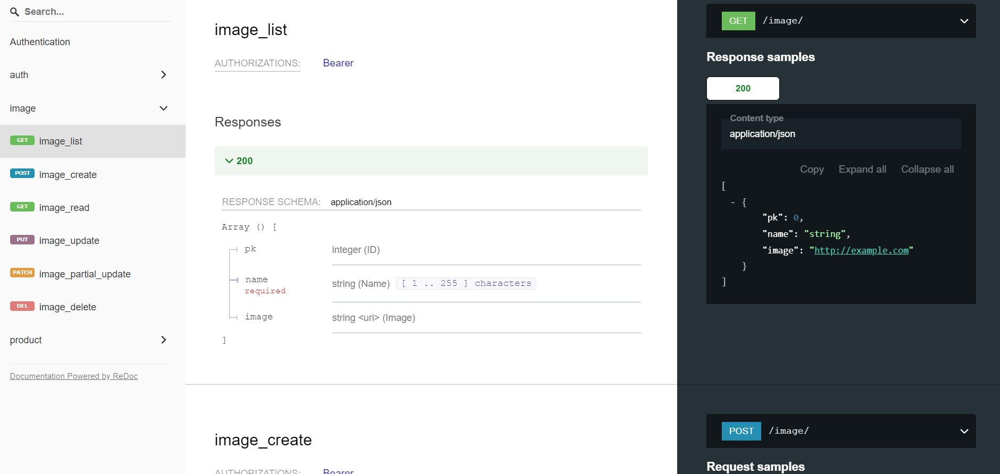
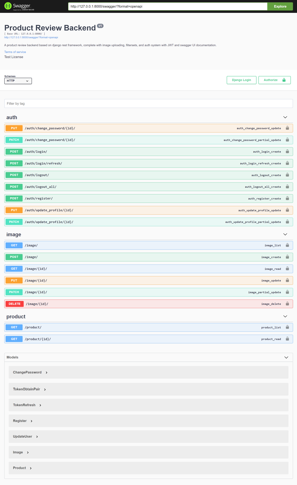
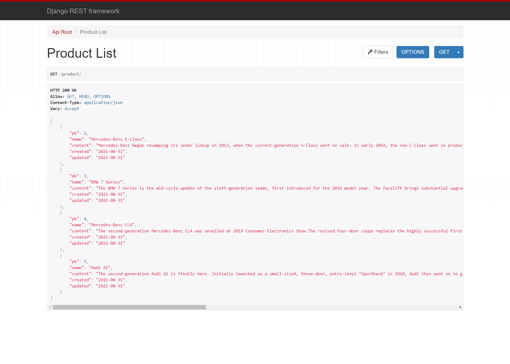

# Product Review Backend

This project is based on django and django rest framework.

## Features

- Basic auth features (register, login, logout, change password)
- Authentication using JWT
- Docs created using drf-yasg and swagger ui
- Image uploading feature


## Usage

```
git clone https://github.com/AshishPandagre/better-blog.git
cd better-blog
python manage.py createsuperuser [enter details]
python manage.py runserver

Head over to /docs to get a complete list of all the endpoints.
```

## Querying methods (additional ones)

- Product List - GET /product/
	- if you want to include spesific fields, add ?fields=pk,name
	- if you want to leave out the content field, add ?omit=content
	- if you want to expand nested relations, add ?expand=category
	- only product name and category name, add ?expand=category&fields=name,category.name
	- if you need a product list response with category, comments and sites (with product size and company) and we dont need a product content field. And category id must be 4. we can do : /product/?expand=category,comments,sites.company,sites.productsize&omit=content&category=4

## Screenshots




